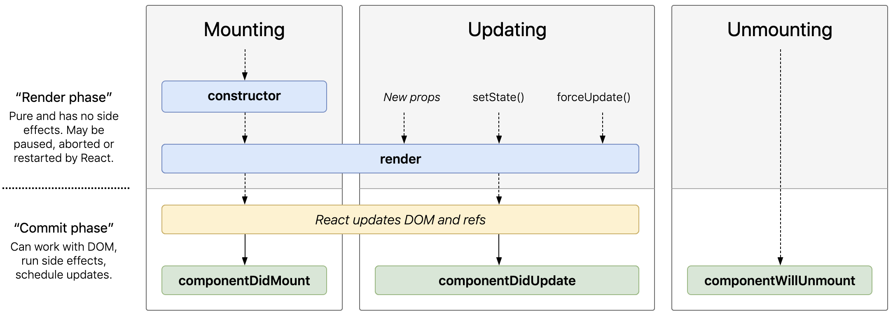

# Day 2 - Theory

## Table of contents

- [State](#state)
- [Props](#props)
- [Components](#components)
  - [Class Components](#class-components)
  - [The Lifecycle of a Component](#the-lifecycle-of-a-component)
  - [Function Components](#function-components)
  - [Hooks](#hooks)
    - [State Hook](#state-hook)
    - [Effect Hook](#effect-hook)

## State

- state is the place where the data comes from
- it is like a global object available anywhere in a component
- it belongs to that particular component where it is defined
- state is mutable, but only inside of the component that owns it
- it is initialized in the constructor for the first time

    ```JavaScript
    import React from 'react';

    class App extends React.Component {
        constructor(props) {
            // we will see later what super(props) means
            super(props);

            // initialize the state
            this.state = {
                x: "This is x from state",
                y: "This is y from state"
            }
        }

        render() {
            return (
                <div>
                    <div>{this.state.x}</div>
                    <div>{this.state.y}</div>
                </div>
            )
        }
    }
    ```

- we can update the state in our component using *setState* method:

    ```JavaScript
    this.setState({x: "This is the new x"})
    ```

- *setState* is asynchronous, so be careful if you call some pieces of code in the same update cycle:

    ```JavaScript
    // wrong way
    this.setState({value: this.state.value + 1})
    ```

    ```JavaScript
    // right way
    this.setState(({value}) => ({value: value + 1}))
    ```

## Props

- props are similar to method arguments
- they are passed to a child component
- props are immutable

    ```JavaScript
    import React from 'react';

    class Dog extends React.Component {
        render() {
            return (
                <div>
                    <label>This is a {this.props.color} dog.</label>
                </div>
            )
        }
    }

    export default Dog;

    const dog = <Dog color="white"></Dog>
    ```

## Components

- components allow us to split de UI into smaller, independent and reusable pieces
- there are two categories of components:
  - class components
  - function components

### Class Components

- the name should start with upper case letter
- we should include *extends React.Component* statement to give our component access to some functions
- need a *render()* method which returns HTML
- a class component has its own state, so can be also called *stateful* component
- e.g.:

  ```JavaScript
    class Student extends React.Component {
        state = {
            name: "Andrei",
            age: 22,
            class: "A1",
        }

        changeClass = () => {
            this.setState({class: "A2"});
        }

        render() {
            return (
                <div>
                    <div>{this.state.name}</div>
                    <button onClick={this.changeClass}>Change Class</button>
                </div>
            )
        }
    }
    ```

- to use this component into our application, it will be called through a HTML syntax: *<Student\/>*

  ```JavaScript
  ReactDOM.render(<Student />, document.getElementById('root'));
  ```

### The Lifecycle of a Component

- each component has several *lifecycle methods* that we can override to execute code at a particular time
- the most common ones are:

(Source: [React lifecycle methods diagram](http://projects.wojtekmaj.pl/react-lifecycle-methods-diagram/))
  - *constructor(props)*
    - it is called before mounting
    - if our component is a subclass, we should first call *super()* or *super(props)*
    - *super* calls also the parent's constructor and makes its methods available in the child class
    - if we want to use *props* in the subclass constructor, call the *super* method with *props* parameter
    - in the constructor, we also initialize the *local state* and bind *event handler* methods to an instance:

        ```JavaScript
        constructor() {
            // calling the parent's constructor
            super();
            // set the local state
            this.state = {timer: null};
            // bind the methods
            this.handleHover = this.handleHover.bind(this);
        }
        ```

  - *componentDidMount()*
    - it is invoked immediately after the component is mounted (means inserted into the DOM's tree)
    - if we want to load data from an endpoint, we should instantiate them here

        ```JavaScript
        componentDidMount() {
            this.setState({ timer: window.setInterval(() => this.getDogs(), 1000) });
        }

        getDogs() {
            fetch(backendUrl.dogsService.getDogs)
                .then(response => response.json())
                .then(dogs => this.setState({ dogs }));
        }
        ```

  - *componentDidUpdate(prevProps, prevState, snapshot)*
    - it is called immediately after an update occurs
    - it is a good place to do network requests if something has changed
    - we need to wrap the requests into a condition which analyzes the previous props and the current ones - otherwise we will request the data in an infinite loop and affect the performance

        ```JavaScript
        componentDidUpdate(prevProps) {
            // don't forget to compare the props
            if (this.props.dogId !== prevProps.dogId) {
                this.getDogById(this.props.dogId);
            }
        }
        ```

  - *componentWillUnmount()*
    - it is invoked immediately before a component is unmounted and destroyed
    - here it is recommended to do some cleanup as cancelling network requests or invalidating timers

        ```JavaScript
        componentWillUnmount() {
            this.setState({ timer: null });
        }
        ```

### Function Components

- also return HTML and behave pretty much the same way as Class components
- before React 16.8, can be called *stateless* because these do not use state at all

   ```JavaScript
    const AuthorsList = ({authors}) => {
        return (
            <ul>
                {authors.map(author => return <li>author</li>)}
            </ul>
        )
    }
    ```

- best practice is to make our components as simple and stateless as possible

### Hooks

- hooks are a new addition in React 16.8
- allow us to use state in functions, without using classes
- hooks are used in function components and do not work into class components
- there are two most commonly used hooks:
  - state hook
  - effect hook

#### State Hook

- *useState* is used as a state hook
- instead of setting an initial state with *this.state* statement in constructor, we can just import *useState* from *react* and set the initial state as an argument
- *useState* returns a pair: the current state value and the function that let us update it

    ```JavaScript
    import React, { useState } from 'react';

    function Counter() {
        // declare a new state variable named 'count' with 0 as initial value
        const [count, setCount] = useState(0);

         return(
             <div>
               <p>You clicked { count } times</p>
               <button onClick={() => setCount(count + 1)}>Click!</button>
             </div>
         )
    }
    ```

- the equivalent Class component  with this Function component is:

    ```JavaScript
    class Counter extends React.Component {
        constructor() {
            this.super();
            this.state = {count: 0};
        }

        render() {
            return(
                <div>
                    <p>You clicked { this.state.count } times</p>
                    <button onClick={() => this.setState({count: this.state.count + 1})}>Click!</button>
                </div>
            )
        }
    }
    ```

#### Effect Hook

- *useEffect* is used as an effect hook
- adds the possibility to serve the Function components as *componentDidMount*, *componentDidUpdate* and *componentWillUnmount* do in Class components
  - *componentDidMount*
    - Class component:

        ```JavaScript
        import React from 'react';

        class Component extends React.Component {
            componentDidMount() {
                console.log("Behavior before the component is added to the DOM");
            }

            render() {
                return <h1>Hello World</h1>;
            }
        };
        ```

    - Function component:

         ```JavaScript
        import React, { useEffect } from 'react';

        const Component = () => {
            // [] as a 2nd parameter of useEffect means this will be invoked one time only
            useEffect(() => {
                console.log("Behavior before the component is added to the DOM");
            }, []);

            return <h1>Hello World</h1>;
        };
        ```

  - *componentDidUpdate*
    - Class component:

        ```JavaScript
        import React from 'react';

        class Component extends React.Component {
            componentDidUpdate(prevProps) {
                if (this.props.foo !== prevProps.foo) {
                    console.log("Behavior when the value of 'foo' changes.");
                }
            }

            render() {
                return <h1>Hello World</h1>;
            }
        };
        ```

    - Function component:

         ```JavaScript
        import React, { useEffect } from 'react';

        const Component = ( {foo} ) => {
            // foo as a 2nd parameter for useEffect means this will be invoked only when 'foo' changes
            useEffect(() => {
                console.log("Behavior when the value of 'foo' changes.");
            }, [foo]);

            return <h1>Hello World</h1>;
        };
        ```

  - *componentWillUnmount*
    - Class component:

        ```JavaScript
        import React from 'react';

        class Component extends React.Component {
            componentDidUpdate(prevProps) {
                console.log("Behavior right before the component is removed from the DOM.");
            }

            render() {
                return <h1>Hello World</h1>;
            }

        };
        ```

    - Function component:

         ```JavaScript
        import React, { useEffect } from 'react';

        const Component = () => {
            // if a function is returned from 'useEffect', it is invoked only when the component is removed from the DOM
            useEffect(() => {
                return () => {
                    console.log("Behavior right before the component is removed from the DOM.");
                }
            }, []);

            return <h1>Hello World</h1>;
        };
        ```
